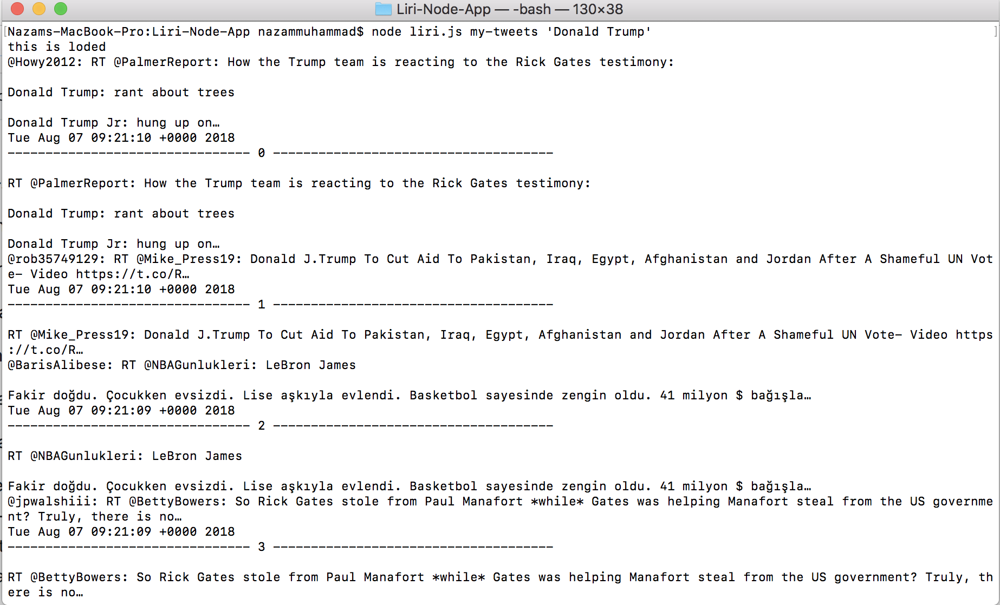
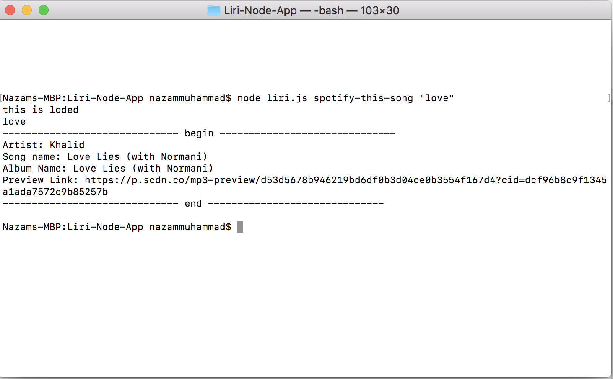
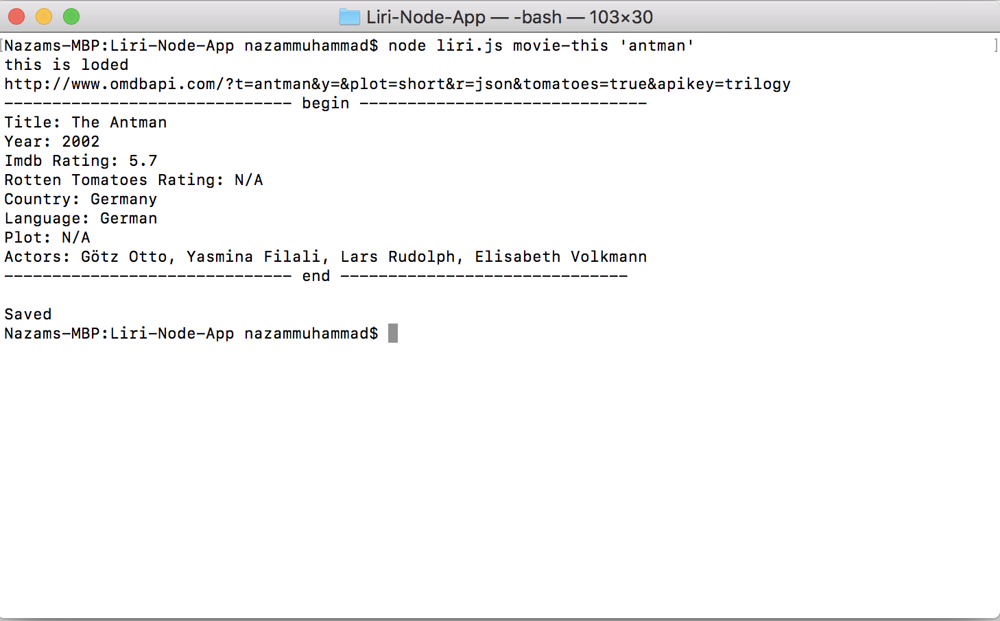

#Liri-Node-App

Introduction

I created a node.js app called LIRI. LIRI is like SIRI (from an iphone).

It must be ran in the command line.

LIRI is a Language Interpretation and Recognition Interface.

LIRI will be a command line node app that takes in parameters and gives you back data.

LIRI will do any of the below command when you enter them into the command line.

1. my-tweets
2. spotify-this-song
3. movie-this
4. do-what-it-says

Type in node liri.js to get the instructions on how to enter the commands correctly. So if you were to type the below command you'd get the last 20 tweets I created (There may not be 20 tweets for me I just created an account)

Example for Twitter :-

node liri.js my-tweets 'any name'

Example for Spotify :-

node liri.js spotify-this-song 'song name'

Example for Movie :-

node liri.js movie-this 'movie name'

These are the npm packages I used and are needed to run the app

1 .fs package in node
2 .twitter
3 .spotify
4 .request

to install these npm packages run these commands one at a time.

1 . npm install twitter
2 . npm install spotify
3 . npm install request

